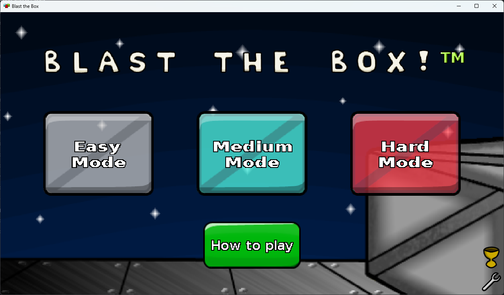
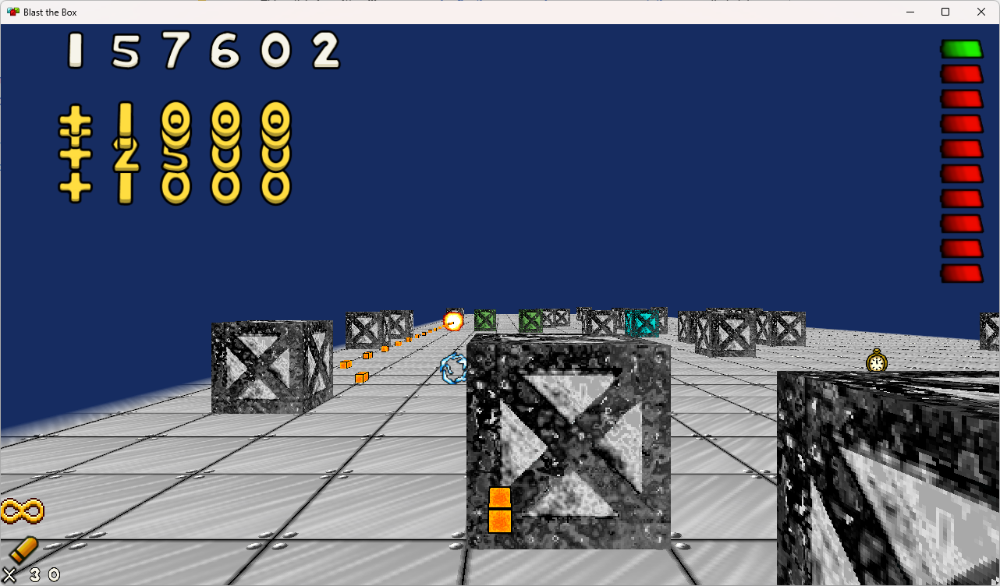

## About Blast The Box

Blast The Box is an arcade-style shooter developed originally for Android with OpenGL. This version ports the game to desktop, using Kotlin, LWJGL, Gradle, and ReactiveX.
Furthermore, the game is now built using an [ECS architecture](https://en.wikipedia.org/wiki/Entity_component_system).

To build, please review the [Build Notes](doc/build_notes.md).

